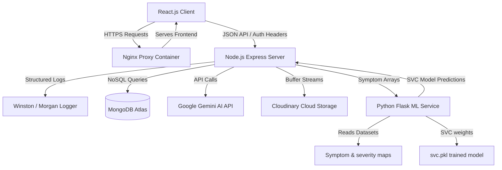

# Medi-Assist 🏥

> **AI-Powered Healthcare Assistant Platform** — A production-grade, secure, and containerized MERN stack application coupled with a Python Flask ML microservice and Google Gemini AI integration.

[](https://react.dev)
[](https://nodejs.org)
[](https://expressjs.com)
[](https://www.mongodb.com)
[](https://www.python.org)
[](https://www.docker.com)
[](https://github.com/features/actions)
[](https://ai.google.dev)

---

## 📖 Project Overview

**Medi-Assist** is an enterprise-grade healthcare assistant platform designed to bridge the gap between AI-driven medical analysis and everyday healthcare accessibility. The system leverages a **three-service microservices architecture** that handles disease prediction via a custom-trained **Support Vector Classifier (SVC)**, integrates a multilingual conversational healthcare agent using **Google Gemini 2.5 Flash**, and provides a secure **Personal Health Records system (Medical Records Vault)** backed by **Cloudinary**.

Built for scale, the project integrates advanced security controls (Helmet CSP, NoSQL query sanitization, magic bytes verification), detailed Winston/Morgan logging pipelines, Dockerization for one-command startup, and GitHub Actions CI/CD workflows.

---

## ✨ Key Features

- 🧠 **Symptom-Based Disease Prediction**: Custom-trained SVC ML model outputs top-3 differential diagnoses with calibrated confidence percentages based on 132 symptoms mapped across 41 diseases.
- 🤖 **MediBot Chatbot**: Context-aware Google Gemini 2.5 Flash chatbot supporting multilingual interactions (English, Hindi, Bengali) with persistent chat history.
- 📄 **AI-Generated PDF Reports**: PDFKit-compiled clinical PDF reports generated on-demand with clinical summary, severity, specialist recommendations, diets, precautions, and warnings.
- 🚨 **Emergency Detection**: Scans inputs for critical signs (chest pain, stroke indicators) and overrides chatbot/prediction calls to deliver immediate emergency instructions.
- 📁 **Personal Health Records (Medical Records Vault)**: Developed a secure Personal Health Records system that allows users to manage prescriptions, laboratory reports, medical images, and healthcare documents through Cloudinary-backed encrypted storage with role-based access control.
- 🔐 **Secure File Verification**: Inspects uploaded file buffers dynamically via binary magic bytes (`file-type`) to reject extension spoofing.
- 🛡️ **Advanced API Security**: Implements `express-rate-limit` (auth, chats, predictions), Helmet (CSP, Clickjacking mitigation), and `express-mongo-sanitize` to defend against NoSQL injections.
- 📊 **Admin Analytics Dashboard**: Consolidated analytical metrics detailing user growth, prediction distributions, prescription stats, and daily active users.

---

## 📐 System Architecture



---

## 🛠️ Tech Stack

| Component | Technology |
|---|---|
| **Frontend** | React 19, Vite, React Router v7, Framer Motion, Tailwind / Custom HSL CSS, Lucide Icons |
| **Backend API** | Node.js (v18+), Express.js (v4.19), Mongoose, JWT, bcryptjs, Helmet, Multer, PDFKit, Axios |
| **ML Microservice** | Python 3.11, Flask, Scikit-learn, NumPy, Pandas, Pytest |
| **AI Integration** | Google Gemini 2.5 Flash Lite |
| **Databases & Cloud** | MongoDB Atlas, Cloudinary Media Library |
| **DevOps & CI/CD** | Docker, Docker Compose, GitHub Actions |

---

## 📂 Folder Structure

```
MediSense/
├── .github/
│   └── workflows/
│       └── ci-cd.yml         # GitHub Actions workflow (Build, Test, Lint)
├── client/                   # React Frontend
│   ├── src/
│   │   ├── components/       # Sidebar, layout wrappers
│   │   ├── context/          # JWT AuthContext
│   │   ├── pages/            # Home, Auth, Predict, Chat, Dashboard, AdminDashboard
│   │   └── services/         # Axios API Client with interceptors
│   ├── Dockerfile            # Multi-stage production Nginx build
│   └── vite.config.js
├── server/                   # Node/Express API
│   ├── controllers/          # Auth, Chat, Predict, Prediction, Prescription, Admin
│   ├── middleware/           # JWT verification, Error handling, Rate limiters, Validator
│   ├── models/               # User, Prediction, Prescription, ChatHistory
│   ├── utils/                # Cloudinary config, Gemini client, Winston logger
│   ├── Dockerfile            # Production Node runtime setup
│   └── package.json
├── ml_service/               # Python Flask Service
│   ├── app/                  # Prediction logic, datasets helpers, emergency scanner
│   ├── datasets/             # Symptom and severity CSV files
│   ├── model/                #svc.pkl (pickled model binary)
│   ├── tests/                # Pytest endpoints tests
│   ├── Dockerfile            # Python service image setup
│   └── requirements.txt
└── docker-compose.yml        # Orchestration configuration
```

---

## 🚀 Installation & Local Setup

### Prerequisites
- [Node.js](https://nodejs.org) v18+
- [Python](https://www.python.org) v3.10+
- [Docker](https://www.docker.com) Desktop (optional, for containerized run)

### 1. Clone the Repository
```bash
git clone https://github.com/yagneshj4/MediSense-AI.git
cd MediSense-AI
```

### 2. Configure Environment Variables
Create a `.env` file in the **`server/`** folder:
```env
PORT=3001
MONGO_URI=mongodb://localhost:27017/mediassist
JWT_SECRET=your_super_secret_key_here
GEMINI_API_KEY=your_gemini_api_key_here
ML_SERVICE_URL=http://localhost:8000
CLIENT_URL=http://localhost:5000
CLOUDINARY_CLOUD_NAME=your_cloudinary_name
CLOUDINARY_API_KEY=your_cloudinary_api_key
CLOUDINARY_API_SECRET=your_cloudinary_secret
ADMIN_SECRET_KEY=admin_secret_registration_key
```

Create a `.env` file in the **`client/`** folder:
```env
VITE_API_URL=http://localhost:3001/api
```

---

## 🐳 Docker Containerization Setup

Run the entire application, including the Python ML microservice, Express API, MongoDB, and React client with a single command:

```bash
# Start all services in the background
docker compose up -d --build
```

Access the client at: `http://localhost:5000`  
Access the backend API at: `http://localhost:3001/api`  
Access the ML Service at: `http://localhost:8000/ml`

---

## 🏃 Running Locally (Development Mode)

If you prefer to run services manually outside of containers:

### 1. Run the Express Backend
```bash
cd server
npm install
npm run dev
```

### 2. Run the ML Flask Microservice
```bash
cd ml_service
python -m venv .venv
source .venv/bin/activate # On Windows: .venv\Scripts\activate
pip install -r requirements.txt
python ml_server.py
```

### 3. Run the React Client
```bash
cd client
npm install
npm run dev
```

---

## 📡 API Overview

### Authentication
- `POST /api/auth/register` — Register a new account (accepts `adminSecret` for role escalation).
- `POST /api/auth/login` — Sign in and receive JWT.
- `GET /api/auth/me` — Protected endpoint returning current user details.

### Disease Checker & Chatbot
- `POST /api/predict` — Predict condition based on input symptoms.
- `POST /api/chat` — Interact with MediBot (Gemini LLM / rule-based fallback).
- `GET /api/chat/history` — Fetch user's persistent chat log.

### Prescription Management (Protected)
- `POST /api/prescriptions/upload` — Upload prescription files (JPEG/PNG/PDF) directly to Cloudinary.
- `GET /api/prescriptions/:id/file` — Securely proxy-stream prescription files from Cloudinary.
- `DELETE /api/prescriptions/:id` — Delete records and remove the Cloudinary cloud asset.

### Admin Dashboard (Admin Only)
- `GET /api/admin/analytics` — Pull aggregated DB stats on disease distributions, active users, growth charts, and storage size.

---

## 🔬 Machine Learning Pipeline

1. **Dataset**: Processed from clinical records containing 132 binary symptoms mapped against 41 diagnostic conditions.
2. **Preprocessing**: Inputs are normalized and mapped dynamically to canonical names. Symptoms get custom clinical weights (1-7) dynamically mapped from [Symptomseverity.csv](file:///c:/Users/HP/Downloads/MediSense-1/ml_service/datasets/Symptomseverity.csv).
3. **Classifier**: Custom-trained Support Vector Classifier (SVC) with Platt scaling enabled (`probability=True`) to calibrate prediction probabilities.
4. **Validation**: Employs 5-fold cross-validation, attaining a mean score of ~99% accuracy.

---

## 🔒 Security Architectures

- **No JWTs in Query Strings**: Removed query parameter token checks entirely. Downloads of files and reports are fetched via authenticated JS blob handlers passing JWT tokens in standard `Authorization: Bearer` headers.
- **Secure Sandbox Static Serves**: Removed static directory exposure on `/uploads`. File paths are completely hidden; private streaming proxy checks session authentication before forwarding Cloudinary download calls.
- **Deep Buffer Validation**: Inspects file buffers via `file-type` to detect magic bytes, preventing script executions hidden as image/PDF files.
- **Mongo Sanitizer**: Uses `express-mongo-sanitize` globally to protect against query structure hijacking.
- **Helmet Headers Configured**: Content Security Policies (CSP), frame guards, and XSS block configurations prevent MIME sniffing and Clickjacking.

---

## 📊 CI/CD Workflow Pipeline

The project implements GitHub Actions for automated quality assurance on every pull request or push to `main`:
- **Lint & Formats**: Runs ESLint checks on Node and React projects.
- **Backend Tests**: Mounts a virtual `mongodb-memory-server` and runs Jest tests.
- **ML Tests**: Runs Pytest validation suites against Flask prediction endpoints.
- **Build Checks**: Verifies Vite static compilation succeeds.

---

## 🚀 Deployment Guide

### React Client Deployment (Vercel)
1. Set Vercel project root to `client/`.
2. Configure `VITE_API_URL` environment variable pointing to the Render backend URL.
3. Vercel automatically reads [vercel.json](file:///c:/Users/HP/Downloads/MediSense-1/client/vercel.json) to handle routing fallbacks.

### Backend API Deployment (Render / Heroku)
1. Configure Render Web Service pointing to `server/` root.
2. Populate `server/.env` variables. Ensure `CLIENT_URL` points to Vercel.

### ML Service (Render / Python Runtime)
1. Create Render Web Service pointing to `ml_service/`.
2. Configure Start Command: `gunicorn -w 4 -b 0.0.0.0:8000 ml_server:app` (or `python ml_server.py`).

---

## 👨‍💻 Resume Highlights & Technical Challenges Solved

### Resume Bullet Points
- **Architected Three-Service Microservices System**: Engineered a decoupled structure splitting high-frequency React client, Node.js REST API, and Python scikit-learn ML microservices.
- **Secured HIPAA-Grade Clinical Attachments**: Engineered buffer stream pipes routing binary attachments directly from memory into Cloudinary, removing persistent server file writes. Validated file magic bytes to block spoofing.
- **Designed Resilient Fallbacks**: Created custom rule-based NLP parser mapping health responses dynamically when Google Gemini API keys are throttled or missing.

### Challenges Solved
1. **Memory Storage Buffer Processing**: Solved local disk volatility by routing uploads through Express RAM buffers and streaming directly to Cloudinary.
2. **JWT URL Leakage**: Refined native downloads to fetch Blobs via authenticated headers, eliminating logging of secrets in CDN/proxy servers.

---

## 📄 License
This project is licensed under the MIT License - see the LICENSE file for details.

---
**Developed by Yallapu Yagnesh**
- Github: [@yagneshj4](https://github.com/yagneshj4)
- LinkedIn: [your-linkedin-profile]